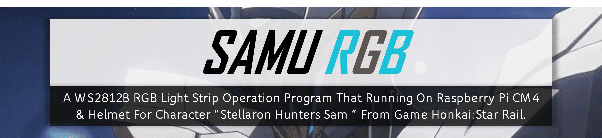

<h6 align="center">
    <br>
    <a href="https://github.com/minexo79/Samu-Rgb">
        
    </a>
    <hr>
    🤖就此離開，沒人會受傷，否則，我將點燃大海!🔥
    <br>
</h6>

# Features
- WS2812B Control
  - [X] Blink Signal RGB LED
  - [ ] Blink Multiple RGB LED
  - [ ] Gradient Effect
  - [ ] Modify Signal RGB LED Color
- Communication Protocol
  - [ ] Protocol Doc
  - [ ] UART
  - [ ] Shared Memory

# Build Steps
## Prerequire
- Arm GNU Toolchain
  - Windows：[AArch64 GNU/Linux target (aarch64-none-linux-gnu)](https://developer.arm.com/-/media/Files/downloads/gnu/11.2-2022.02/binrel/gcc-arm-11.2-2022.02-mingw-w64-i686-aarch64-none-linux-gnu.zip?rev=47c49a43aa81408b9688daea870832a5&hash=83CD11A792F93343A917E741132D5CD7)
  - Linux：[AArch64 GNU/Linux target (aarch64-none-linux-gnu)](https://developer.arm.com/-/media/Files/downloads/gnu/11.2-2022.02/binrel/gcc-arm-11.2-2022.02-x86_64-aarch64-none-linux-gnu.tar.xz?rev=33c6e30e5ac64e6dba8f0431f2c35f1b&hash=AE0C3F32FC140B87A05846EBF94947227)
- Make
  - Windows：[Make for Windows](https://gnuwin32.sourceforge.net/packages/make.htm)
  - Linux - Ubuntu：`sudo apt install make`

## Build All
```sh
make
```
- it will generate `samu_rgb_rel` execute in project root folder.

## Clean
```sh
make clean
```

# Default Parameters
- utils.h
```c
#define SPI_DEVICE      "/dev/spidev0.0"
#define SPI_MODE        SPI_MODE_0      // CPOL = SPI_MODE_0
#define SPI_BIT_WORD    8               // 8 bits per word
#define SPI_SPEED       6400000         // 6.4MHz for WS2812B
```

# License / Copyright
## Program
- The Program Use MIT License.
## Characters
- All Characters Copyright Are Reserved From miHoYo Co. Ltd.